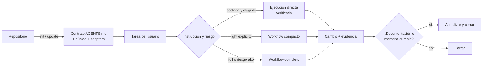

# Capa agéntica reutilizable

Capa de desarrollo asistido por agentes para Codex y Claude Code, adoptable en cualquier repositorio con un solo comando y sin dependencias de runtime.

> 🛤️ El repositorio conserva el destino; esta capa pone los rieles, las señales y los controles para que los agentes no improvisen el viaje.

## Qué hace

- Instala un proceso común para planificar, implementar, verificar y documentar cambios.
- Define roles especializados, workflows por intención y criterios de cierre verificables.
- Añade un contrato de proyecto en `AGENTS.md` para que cada agente conozca arquitectura, comandos, tests, Git y restricciones reales.
- Integra adapters delgados para Codex y Claude Code sin duplicar la política canónica.
- Incluye comandos transaccionales para adoptar y actualizar la capa.

No añade código de producto, no instala herramientas, no gestiona Git ni se sincroniza automáticamente.

## Por qué es útil

- **Consistencia:** el mismo proceso funciona en repositorios y hosts distintos.
- **Proporcionalidad:** una tarea pequeña puede ejecutarse directamente; el aislamiento completo se reserva para el riesgo que lo justifica.
- **Trazabilidad:** cada cambio conserva alcance, criterios y evidencia, en vez de depender de contexto implícito.
- **Estado determinista:** las sesiones nuevas usan protocolo V2 estructurado;
  la prosa de un reporte nunca decide un gate.
- **Mantenimiento simple:** `.agents/` es la única fuente de verdad y los adapters solo apuntan a ella.

## Requisitos

| Requisito | Para instalar o actualizar | Para orquestar |
| --- | :---: | :---: |
| Node.js 20 o superior | Sí | Sí |
| Codex o Claude Code | No | Sí |
| CodeGraph con índice vigente | No | Sí |
| Engram disponible para el proyecto | No | Sí |
| Subagentes nativos | No | Sí |
| Contrato de `AGENTS.md` completo | No | Sí |

Solo Node.js es necesario para copiar la capa. Si CodeGraph o Engram faltan, la instalación termina con salida `4`: los archivos quedan instalados, pero la orquestación permanece bloqueada hasta completar los requisitos.

## Setup / inicio rápido

Desde la raíz del repositorio que adoptará la capa:

1. Revisa el plan sin modificar archivos:

   ```text
   npx --yes github:KroxiDev/agentic-layer init . --dry-run
   ```

2. Aplica la instalación:

   ```text
   npx --yes github:KroxiDev/agentic-layer init .
   ```

   El comando muestra el plan completo y pide confirmación antes de escribir. Para una ejecución no interactiva, añade otro `--yes` después del destino.

3. Revisa el resumen y completa en `AGENTS.md` cualquier campo marcado como `<pendiente: …>`.

4. Configura CodeGraph y Engram si todavía no están disponibles, y versiona `AGENTS.md` junto con `.agents/VERSION`.

5. Abre el proyecto desde su raíz en Codex o Claude Code. Los adapters y agentes se descubren desde allí.

`npx` ejecuta el paquete una vez: no lo añade como dependencia ni deja un vínculo con este repositorio.

## Actualizar una instalación

Desde la raíz de un proyecto que ya tenga la capa:

1. Guarda o confirma primero los cambios locales importantes.

2. Inspecciona la actualización:

   ```text
   npx --yes github:KroxiDev/agentic-layer update . --dry-run
   ```

3. Aplícala en una terminal interactiva:

   ```text
   npx --yes github:KroxiDev/agentic-layer update .
   ```

4. Revisa el diff y resuelve los nuevos campos pendientes del contrato, si los hubiera.

`update` reconoce instalaciones antiguas incluso sin `.agents/VERSION`, conserva los hechos explícitos de `AGENTS.md`, las DevSessions y los archivos ajenos, y repara los archivos canónicos aunque la versión ya coincida. Una versión instalada más nueva se bloquea salvo autorización explícita con `--allow-downgrade`.

Si un contrato histórico contiene entradas que no corresponden al esquema actual, la terminal permite mapearlas, conservarlas como reglas adicionales, eliminarlas o cancelar. En modo no interactivo y en `--dry-run`, el destino no cambia y el comando termina con salida `2` para que la decisión no se tome por inferencia.

## Opciones útiles

| Opción | Uso recomendado |
| --- | --- |
| `--dry-run` | Ver el plan completo sin escribir |
| `-y`, `--yes` | Omitir la confirmación general; no resuelve entradas contractuales ambiguas |
| `--force` | Reemplazar archivos canónicos divergentes y residuos de una capa instalada; revisar el plan antes |
| `--purpose <texto>` | Declarar el propósito del proyecto durante el setup |
| `--git-strategy <texto>` | Declarar la estrategia Git durante el setup |
| `--init-codegraph` / `--update-codegraph` | Autorizar explícitamente `codegraph init` o `codegraph sync` |
| `--allow-downgrade` | Autorizar una versión anterior; solo existe en `update` |
| `--codex-config global\|local\|none` | Elegir durante `update` si se configura la capacidad técnica de Codex |

Consulta la interfaz completa con:

```text
npx --yes github:KroxiDev/agentic-layer init --help
npx --yes github:KroxiDev/agentic-layer update --help
```

## Cómo se usa

En Codex basta con describir la tarea. La política decide el modo y también
admite una elección explícita:

| Modo | Cuándo usarlo |
| --- | --- |
| Directa verificada | Tarea pequeña, de un sector y sin riesgos de arquitectura, seguridad o migración |
| `light` | Ruta compacta solicitada explícitamente para un alcance elegible |
| `full` | Workflow completo, pedido explícitamente o activado por una categoría de riesgo |

`sin orquestar` exige la primera ruta; si sus límites no se cumplen, la tarea se
detiene en vez de degradar garantías.

Existe una única excepción bootstrap: el propietario puede exigir ejecución
directa para reparar un defecto demostrado de esta capa canónica desde una
especificación externa cerrada, evitando ejecutar el runtime defectuoso sobre
sí mismo. Sigue siendo obligatorio trabajar con un solo writer, aplicar
seguridad y ejecutar las validaciones focalizada, completa y de distribución.

En Claude Code, abre también la raíz del proyecto y usa `/orquestar <tarea>` cuando quieras activar la capa de forma explícita.

## Funcionamiento



La política canónica define la clasificación, los límites y las excepciones. Los detalles de módulos, roles, sesiones, paralelismo, gates, recuperación y distribución están en la [documentación de arquitectura](docs/arquitectura.md).

## Protocolo de orquestación V2

Las sesiones nuevas se coordinan mediante `OrchestrationKernel`, cuya única
interface operativa es `apply(command)` e `inspect(sessionId)`. El kernel
concentra revisión CAS, idempotencia, ownership, aceptación congelada, lanes,
presupuesto, persistencia y telemetría. El controller Markdown anterior se
distribuye únicamente para terminar o migrar sesiones v1 en un checkpoint
seguro.

Cada rol recibe un `WorkEnvelope` inmutable: enumera referencias deduplicadas en
`contextPaths`, registra su `sourceRevision` y el hash del contrato de
aceptación, pero no incluye la capacidad del orquestador. El rol devuelve un
`RoleReport` estructurado; `humanSummary` es legible para personas y nunca
determina una transición.

El protocolo se publica como conjunto indivisible de kernel, políticas, roles,
workflows, templates y schemas. `.agents/protocol.json` declara la versión y los
overrides permitidos; la suite de conformidad detecta mezclas de versiones o
modificaciones de la interface antes de distribuirlas.

El lector v1 tiene una ventana publicada hasta el 17 de noviembre de 2026. Esa
fecha no provoca un retiro automático: solo puede retirarse después de ella y
cuando existan dos releases V2 estables y cero sesiones v1 activas en los
consumidores prioritarios.

## Errores de setup o actualización

| Síntoma | Qué significa | Qué hacer |
| --- | --- | --- |
| Salida `1` por destino no seguro | Se eligió la raíz del sistema, el directorio personal o una ruta atravesada por un enlace simbólico | Ejecutar el comando sobre la raíz real del repositorio |
| Salida `2` por colisiones | Una ruta canónica está ocupada por un archivo ajeno | Revisar y mover el archivo; no forzar una colisión desconocida |
| Salida `2` por divergencias | Ya existe una capa modificada y no hubo decisión interactiva | Usar `update`; aplicar `--force` solo después de revisar las rutas canónicas afectadas |
| `--force` no reemplaza un enlace o directorio | La ruta no es un archivo canónico reemplazable | Resolverla manualmente; `--force` nunca borra esos objetos |
| Salida `2` por entradas contractuales no mapeables | `update` necesita una decisión humana | Repetir en una terminal interactiva y resolver cada entrada |
| `No se detectó una capa agéntica existente` | Se ejecutó `update` en un proyecto sin capa | Usar `agentic init [destino]` |
| Versión posterior o `.agents/VERSION` inválido | El downgrade no fue autorizado o la versión no es SemVer válida | Revisar la versión; usar `--allow-downgrade` solo de forma intencional |
| Salida `4`: CodeGraph o Engram ausentes | La copia terminó, pero el preflight de orquestación no puede pasar | Configurar la herramienta indicada; para CodeGraph también existen las banderas explícitas del setup |
| La primera tarea se detiene por contrato incompleto | Quedan campos `<pendiente: …>` en `AGENTS.md` | Completar únicamente los hechos que el mensaje enumera |
| No aparecen agentes o `/orquestar` | El host no abrió el proyecto desde su raíz | Reabrir la carpeta que contiene `AGENTS.md` |

Códigos de salida: `0` correcto · `1` error de uso · `2` bloqueo seguro sin escrituras · `3` cancelado · `4` capa instalada con requisitos ausentes.

## Recomendaciones

- Ejecuta `--dry-run` y parte de un estado recuperable antes de instalar o actualizar.
- Versiona `.agents/VERSION`; es la marca que permite comparar y migrar instalaciones.
- Completa el contrato con hechos concretos y comandos reproducibles. Una capa precisa no puede compensar un contrato vago.
- Mantén CodeGraph sincronizado, Engram en ámbito de proyecto y el repositorio abierto desde su raíz.
- Conserva las personalizaciones del proyecto en `AGENTS.md`; evita duplicar o modificar la política canónica sin una razón deliberada.
- Usa `--force` y `--allow-downgrade` como bisturí, no como martillo. 🔨

## Documentación técnica

- [Arquitectura](docs/arquitectura.md): estructura, flujos, sesiones, gates y frontera de distribución.
- [Núcleo interno](.agents/README.md): mapa de propietarios e invariantes.
- [Política de orquestación](.agents/policies/orquestacion.md): activación, modos, validación y cierre.
- [Glosario](CONTEXT.md): lenguaje del dominio.
- [ADRs](docs/adr/): decisiones arquitectónicas y trade-offs.

`CONTEXT.md` y `docs/` sirven para mantener esta plantilla y no se copian al proyecto adoptante.

## Licencia

[MIT](LICENSE).
