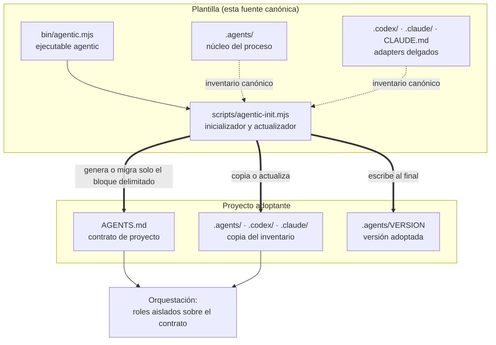
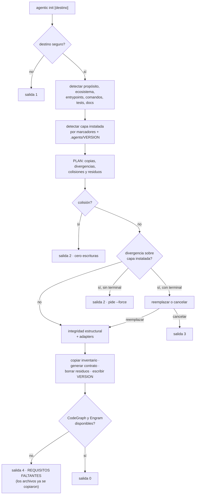
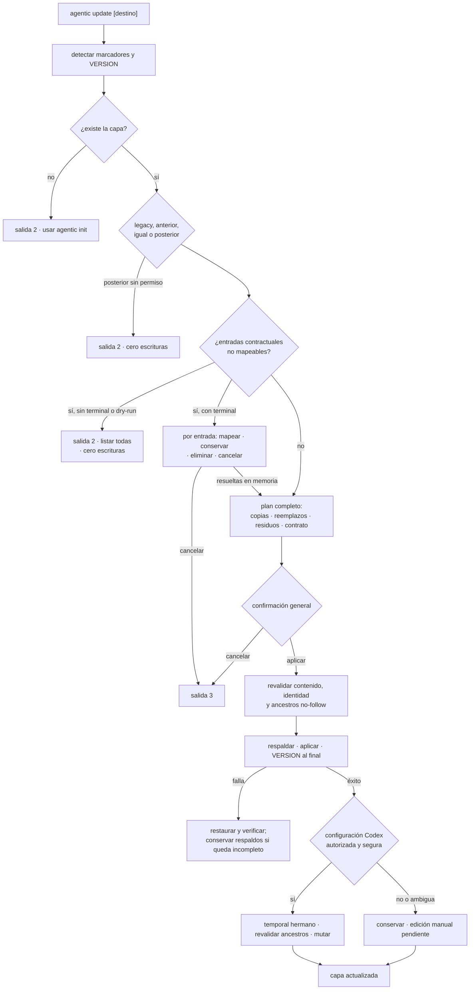
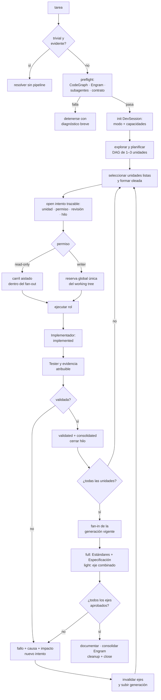

# Arquitectura

Detalle interno de la plantilla. La vista resumida está en el
[README](../README.md); el vocabulario, en [CONTEXT.md](../CONTEXT.md). Esta
documentación no se distribuye con la capa.

## Las dos mitades

El repositorio hace dos cosas independientes, y conviene no confundirlas:

1. **El proceso** (`.agents/` y sus adapters): lo que gobierna cómo un agente
   desarrolla en un proyecto. Es texto; no se ejecuta.
2. **La adopción y actualización** (`bin/` y `scripts/`): lo que copia o
   actualiza ese proceso y mantiene su contrato. Es código; se ejecuta solo por
   orden explícita del propietario y no sincroniza el destino automáticamente.



La flecha que no existe es la importante: el destino no vuelve hacia la
plantilla. No hay dependencia declarada, remoto upstream ni sincronización
automática — ver [ADR 0001](adr/0001-adopcion-por-copia.md).

## Estructura completa

```text
.
├── README.md                    # adopción y operación (se distribuye)
├── CONTEXT.md                   # glosario del dominio (no se distribuye)
├── AGENTS.md                    # reglas globales + contrato de proyecto
├── CLAUDE.md                    # import fijo de AGENTS.md
├── LICENSE
├── package.json                 # manifiesto e inventario canónico
├── .gitignore
├── bin/
│   └── agentic.mjs              # ejecutable; despacha `init` y `update`
├── scripts/
│   └── agentic-init.mjs         # única implementación de init/update
├── tests/
│   └── agentic-init.test.mjs    # especificación ejecutable de la CLI
├── docs/                        # documentación interna (no se distribuye)
│   ├── arquitectura.md
│   └── adr/
├── .agents/                     # NÚCLEO — fuente de verdad del proceso
│   ├── README.md                # documentación del módulo interno
│   ├── VERSION                  # generado en la adopción, no distribuido
│   ├── policies/
│   │   ├── orquestacion.md      # precedencia, preflight, modos, delegación
│   │   ├── regla-de-oro.md       # regla transversal para código y pruebas
│   │   └── sdd-tdd.md            # SDD proporcional y vocabulario de diseño
│   ├── roles/                   # seis roles: entradas, proceso, salida, límites
│   │   ├── explorador.md
│   │   ├── planificador.md
│   │   ├── implementador.md
│   │   ├── tester.md
│   │   ├── evaluador.md
│   │   └── documentador.md
│   ├── scripts/
│   │   └── session-controller.mjs # ciclo portable de sesiones
│   ├── workflows/
│   │   ├── feature.md
│   │   ├── bugfix.md
│   │   ├── refactor.md
│   │   └── architecture.md
│   ├── skills/                  # procedimientos portables
│   │   ├── orquestar/SKILL.md
│   │   ├── agentic-grilling/SKILL.md
│   │   ├── agentic-tdd/SKILL.md
│   │   └── agentic-diagnostico-bugs/
│   │       ├── SKILL.md
│   │       └── references/      # contrato HITL + esqueletos sh y ps1
│   ├── templates/
│   │   ├── dev-session.md       # estado global de una tarea
│   │   └── subdev-session.md    # sobre efímero por fase e intento
│   └── sessions/
│       └── gitignore.asset      # se instala como .gitignore
├── .codex/agents/               # ADAPTER — seis TOML
└── .claude/
    ├── gitignore.asset          # se instala como .gitignore
    ├── agents/                  # ADAPTER — seis Markdown
    └── skills/orquestar/SKILL.md
```

## Mapa de módulos

| Parte | Responsabilidad | Profundidad |
| --- | --- | --- |
| `.agents/policies/` | Orquestación, SDD/TDD y Regla de Oro para código y pruebas | Profundo: gobierna todo el proceso |
| `.agents/roles/` | Seis contratos de salida con límites explícitos | Profundo: cada rol oculta su método |
| `.agents/scripts/session-controller.mjs` | Unidades/DAG, gates, capacidades, generaciones, transiciones, locks globales, recuperación, acuses y limpieza | Profundo: una CLI portable y transaccional |
| `.agents/workflows/` | Orden de fases por intención | Delgado: sólo secuencia |
| `.agents/skills/` | Procedimientos invocables (grilling, TDD, diagnóstico) | Profundo: disciplina completa por archivo |
| `.agents/templates/` | Formato de la DevSession global y de los sobres efímeros | Delgado: estructura |
| `AGENTS.md` | Seam de configuración: hechos y restricciones del proyecto | Interface mínima de toda la capa |
| `.codex/agents/*.toml` | Nombre, descripción, sandbox y puntero al rol canónico | Delgado por diseño |
| `.claude/agents/*.md` | Frontmatter de herramientas y permisos, y puntero al rol | Delgado por diseño |
| `.claude/skills/orquestar/` | Activación nativa que remite a la skill canónica | Delgado por diseño |
| `CLAUDE.md` | `@AGENTS.md` y nada más | Delgado por diseño |
| `bin/agentic.mjs` | Despacho de `init`, `update` y ayuda | Delgado: no reimplementa nada |
| `scripts/agentic-init.mjs` | Detección, plan, copia/actualización recuperable, contrato, configuración opcional de Codex y comprobaciones | Profundo: toda la adopción y actualización |
| `tests/agentic-init.test.mjs` | Comportamiento público de la CLI en directorios temporales | Especificación ejecutable |

La regla que mantiene la interface pequeña: un proyecto normal edita
`AGENTS.md` y nada más — ver [ADR 0002](adr/0002-agents-md-como-unico-seam.md).
Los adapters aplican restricciones técnicas y apuntan a rutas canónicas; nunca
duplican políticas.

## Flujo de adopción

`agentic init` es transaccional: calcula el plan completo antes de escribir y
cualquier condición bloqueante lo detiene con el disco intacto.



Puntos que no son obvios leyendo el código por partes:

- **La detección no pregunta nunca.** Lo que no puede inferir queda como campo
  pendiente y se lista al terminar — ver
  [ADR 0003](adr/0003-inicializador-sin-conversacion.md).
- **Lo ya declarado gana.** Los valores explícitos que ya estén en el contrato
  sobreviven a cualquier reejecución; `--force` no reescribe `AGENTS.md` fuera
  del bloque delimitado, ni dentro de él.
- **Una copia de la plantilla no hereda su propósito.** Si el destino trae el
  `AGENTS.md` y el `README.md` de la plantilla sin tocar, el propósito detectado
  se descarta y queda pendiente: es el del proceso, no el del proyecto.
- **Revalidación justo antes de escribir.** Si un archivo aparece o cambia entre
  el plan y la escritura, se aborta el resto.
- **Salida 4 no revierte nada.** La capa queda instalada; lo que falta son las
  herramientas que el preflight de orquestación exigirá después — ver
  [ADR 0004](adr/0004-requisitos-obligatorios-con-fallo-cerrado.md).

## Flujo de actualización

`agentic update` reutiliza el mismo motor y añade una transacción recuperable.
La configuración opcional de Codex ocurre después del éxito de la capa y nunca
la revierte.



La migración contractual reconoce campos históricos por alias y los contratos
nuevos por IDs estables. Solo `<pendiente: …>`, el placeholder histórico
admitido y los estados textuales `TODO`, `pendiente`, `por definir` o `TBD`
cuentan como valores ausentes; autolinks Markdown y otros hechos legítimos con
ángulos se preservan.

Los campos y bullets que no puedan mapearse se reúnen por completo antes de
construir cualquier escritura. En modo interactivo cada entrada puede dirigirse
a un campo canónico libre, conservarse, eliminarse con confirmación adicional o
cancelar toda la actualización. Las elecciones solo mutan el plan en memoria;
`AGENTS.md` se escribe junto con la transacción y participa en el mismo rollback.
En `--yes`, `--non-interactive`, sin TTY o `--dry-run`, el comando informa todas
las entradas y alternativas, termina con salida `2` y deja el destino byte a
byte intacto.

El bloque delimitado es el **contrato administrado** y solo admite el esquema
canónico con sus IDs estables. Conservar una entrada es una elección explícita
que la retira de ese bloque y mantiene el bullet y sus continuaciones bajo
`## Reglas adicionales del proyecto`, fuera de los marcadores. La sección se
reutiliza si existe y la transformación es idempotente; esas reglas siguen
siendo instrucciones efectivas de `AGENTS.md`, aunque ya no sean parte del
contrato administrado.

El editor de `config.toml` entiende únicamente la forma inequívoca de `[agents]`
y las claves `max_concurrent_threads_per_session` o `max_threads`. Conserva BOM,
finales de línea, comentarios y el resto del archivo. Tablas o claves ambiguas,
UTF-8 inválido y strings TOML multilínea se derivan a edición manual sin escribir.
La ruta global se obtiene de `CODEX_HOME` o del directorio personal; las pruebas
siempre inyectan una raíz temporal. El valor objetivo es 12 como capacidad
técnica de Codex; los workflows aplican después sus topes independientes de 4
(`light`) y 9 (`full`).

## Flujo de orquestación



El ciclo Evaluador → Implementador admite **dos** retrabajos como máximo; si el
rechazo persiste, la tarea se detiene y se presenta el diagnóstico.

Cada fase corre aislada y devuelve sólo su contrato de salida. El orquestador es
el único que habla con el usuario: los roles no se coordinan entre sí ni amplían
el alcance.

### Presupuesto, capacidad y aislamiento

La capacidad se compone y no se representa con un único número:

| Dimensión | Semántica |
| --- | --- |
| Capacidad técnica de Codex | Hasta 12 hilos de subagentes; habilita, pero no cambia la política |
| Presupuesto `light` | Máximo 4 subagentes activos |
| Presupuesto `full` | Máximo 9 subagentes activos |
| Capacidad de plataforma | Disponibilidad real detectada en el host |
| Capacidad `read-only` | Carriles de lectura simultáneos, acotados por modo y plataforma |
| Aislamiento de escritores | Uno por working tree sin worktrees aislados aprobados |

El Orquestador no cuenta en 4/9. La capacidad total de agentes es el mínimo
entre modo y plataforma; la capacidad efectiva de una fase añade el trabajo
listo y los topes del rol. Los carriles `read-only` y writers consumen el total,
pero se contabilizan por separado: un writer no ocupa el cupo de lectura y un
lector no ocupa aislamiento de escritura. Con menos capacidad se reduce el
fan-out usando agentes reales; no se simulan agentes ni se sustituyen por
procesos auxiliares.

### Unidades, intentos, DAG y gates

El Planificador registra de una a tres unidades verticales. Cada unidad guarda
`workUnitId`, `acceptanceCriteria`, `dependsOn`, `ownedPaths`, `permission` y
`wave`. El controlador rechaza contratos incompletos, IDs duplicados,
dependencias ausentes, ciclos y colisiones antes de crear la DevSession.

La unidad y el intento son identidades distintas. La primera representa el
trabajo a través de sus retrabajos; el segundo es una ejecución monotónica de
fase y rol con `baseRevision`, `threadId`, criterios, permiso, causa e intento
anterior. Un intento terminal es inmutable. Una unidad validada sólo se reabre
con impacto demostrado.

Los gates son mecánicos:

1. el Implementador consolida evidencia y deja la unidad `implemented`;
2. el Tester sólo puede abrir sobre ese estado y la deja `validated` o
   `failed`;
3. una validación verde la deja además `consolidated` y puede satisfacer
   `dependsOn`.

Las oleadas se derivan del DAG y contienen únicamente unidades listas. La
propiedad de rutas writer es exclusiva y portable: se normalizan rutas
relativas, se rechazan escapes y se detectan colisiones exactas o de
ancestro/descendiente, incluidas mayúsculas y aliases terminales de Windows.

### Writer lock, recuperación e idempotencia

El aislamiento writer no es local a una DevSession. El controlador deriva la
identidad canónica del working tree y publica por hard link un único archivo
`.writer-<workingTreeId>.lock`. Su dueño exacto contiene `session`, `attempt` y
`workingTreeId`, por lo que dos DevSessions del mismo árbol compiten por la
misma reserva aunque declaren rutas diferentes.

Una transición inicial y la reparación de un checkpoint liberan de forma
estricta: un dueño distinto es conflicto. Cuando `commit` o `fail` ya están
terminales y el mismo payload se repite, la operación sigue siendo idempotente
pero libera sólo si la reserva todavía coincide exactamente. Si un writer
sucesor ya la adquirió, el reintento devuelve éxito sin eliminar, modificar ni
reclamar su lock. Si una interrupción dejó el lock en el intento original, el
checkpoint recuperado sí lo libera.

`status` y `recover` son de sólo lectura. Los temporales de publicación se
eliminan en la propia adquisición y los residuos ambiguos nunca se borran por
edad. `cleanup` continúa limitado a sobres acusados y `safe_to_delete`.

### Fan-in, generaciones y sesiones heredadas

El fan-in sólo queda listo cuando todas las unidades están validadas y
consolidadas. En `full`, Estándares y Especificación son ejes independientes de
solo lectura; en `light`, un eje combinado cubre ambos. Cada fan-in lleva una
generación. Reabrir una unidad incrementa esa generación, limpia sus resultados
y vuelve obsoleto cualquier Evaluador anterior; sólo los ejes aprobados de la
generación actual permiten `close`.

Las DevSessions v1 sin unidades conservan su comportamiento. Una sesión por
unidades creada antes de que existieran criterios, capacidades separadas o
generación falla cerradamente antes de `open`. Repetir `init` con el plan
aprobado completa únicamente esos campos ausentes, preserva intentos, estados,
ownership y evidencia, y es byte-idempotente al volver a ejecutarse. La
decisión completa está en
[ADR 0009](adr/0009-paralelismo-controlado-por-unidades.md); extiende el
controlador portable de [ADR 0008](adr/0008-controlador-portable-de-subdevsessions.md).

## Frontera de distribución

Lo que viaja en el paquete está declarado dos veces —en el código y en
`package.json`— y el inicializador falla si las dos listas no coinciden.

| Categoría | Ejemplos | Viaja |
| --- | --- | --- |
| Inventario canónico | `.agents/`, `.codex/`, `.claude/`, `CLAUDE.md` | Sí |
| Soporte de la distribución | `AGENTS.md`, `README.md`, `LICENSE`, `package.json`, `bin/`, `scripts/` | Sí |
| Assets de distribución | `gitignore.asset` ×2 | Sí, con nombre neutro |
| Estado del proyecto | `.agents/VERSION`, DevSessions reales, `*.local.json` | No |
| Herramientas locales | `.codegraph/`, `.engram/`, `node_modules/`, `*.tgz` | No |
| Desarrollo de la plantilla | `tests/`, `.gitignore` | No |
| Documentación interna | `CONTEXT.md`, `docs/` | No |

Dos consecuencias que sorprenden al leer el código:

- **`.gitignore` no puede distribuirse con su nombre.** npm renombra a
  `.npmignore` cualquier `.gitignore` empaquetado, así que los dos que la capa
  instala viajan como `gitignore.asset` y el inicializador restaura el nombre
  canónico al copiarlos.
- **Los enlaces a documentación interna sólo se comprueban aquí.** La
  integridad estructural resuelve todos los enlaces Markdown del inventario,
  pero omite los que apuntan a rutas exclusivas del desarrollo cuando corre
  desde un paquete instalado, donde esas rutas no existen — ver
  [ADR 0006](adr/0006-documentacion-interna-fuera-de-la-distribucion.md).

## Contrato de proyecto

El inicializador crea, completa o reemplaza únicamente el bloque delimitado, y
conserva literalmente todo lo que haya antes y después:

```markdown
<!-- AGENTIC_PROJECT_CONTRACT_START -->

## Desarrollo
- Activación de la Regla de Oro para cambios de código o pruebas

## Proyecto
- Propósito / Arquitectura / Entrypoints

## Validación
- Focalizada / Completa

## Tests
- Framework / Ubicación / Ciclo de vida

## Git
- Rama o estrategia permitida

## Seguridad
- Secretos / Rutas protegidas / Datos inmutables / Acciones restringidas /
  Contaminación de origen

## Documentación
- README y documentación técnica / ADRs

<!-- AGENTIC_PROJECT_CONTRACT_END -->
```

Solo el marcador generado `<pendiente: …>`, el placeholder histórico admitido,
un valor vacío o uno que empiece por `TODO`, `pendiente`, `por definir` o `TBD`
cuenta como ausente. Los autolinks y otros valores explícitos con ángulos no son
placeholders. La regla
`STRICT_PROJECT_CONTRACT_RULE` de `.agents/policies/orquestacion.md` lo cobra y
detiene la orquestación indicando archivo, sección y campo exactos. El
propietario puede flexibilizar o eliminar ese bloque delimitado; hacerlo cambia
una garantía de la capa deliberadamente.

Un `AGENTS.md` anidado redefine para su sector Proyecto, Validación, Tests y
Documentación. Nunca debilita seguridad, requisitos de herramientas ni
orquestación: esas restricciones se acumulan y prevalece la más estricta.

## Deuda de vocabulario conocida

Dos nombres del código no siguen el glosario y se conservan a propósito para no
romper la interface pública:

- La salida del plan usa `validar:` para «el archivo ya coincide con el
  canónico», mientras que `Validación` en el contrato significa la evidencia
  del proyecto. Son cosas distintas con la misma palabra; el segundo sentido es
  el canónico.
- `PACKAGE_FILES` nombra lo que el glosario llama inventario canónico. Los
  tests lo importan con ese nombre.
