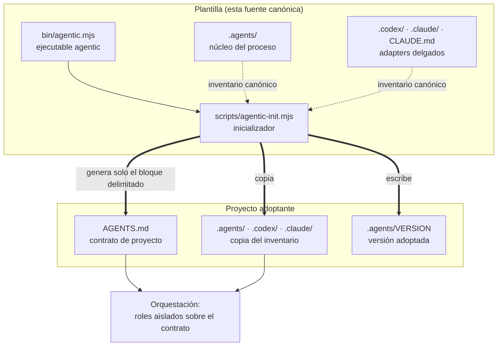
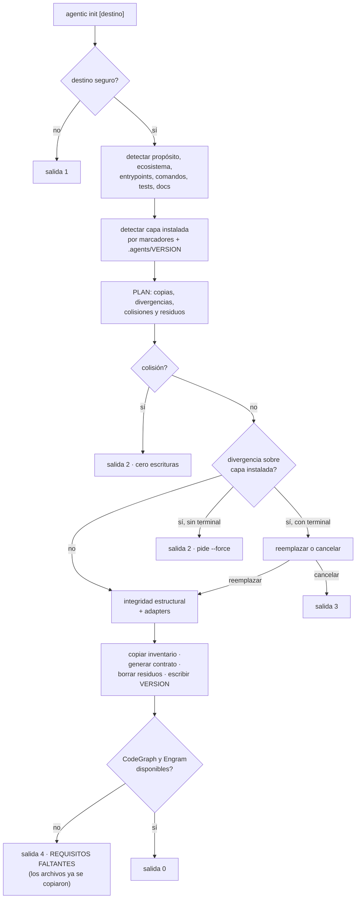
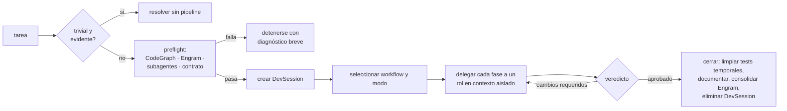

# Arquitectura

Detalle interno de la plantilla. La vista resumida está en el
[README](../README.md); el vocabulario, en [CONTEXT.md](../CONTEXT.md). Esta
documentación no se distribuye con la capa.

## Las dos mitades

El repositorio hace dos cosas independientes, y conviene no confundirlas:

1. **El proceso** (`.agents/` y sus adapters): lo que gobierna cómo un agente
   desarrolla en un proyecto. Es texto; no se ejecuta.
2. **La adopción** (`bin/` y `scripts/`): lo que copia ese proceso a un
   proyecto y genera su contrato. Es código; se ejecuta una vez por adopción y
   no participa después.



La flecha que no existe es la importante: el destino no vuelve hacia la
plantilla. No hay dependencia declarada, remoto upstream ni sincronización
automática — ver [ADR 0001](adr/0001-adopcion-por-copia.md).

## Estructura completa

```text
.
├── README.md                    # adopción y operación (se distribuye)
├── CONTEXT.md                   # glosario del dominio (no se distribuye)
├── AGENTS.md                    # reglas globales + contrato de proyecto
├── CLAUDE.md                    # import fijo de AGENTS.md
├── LICENSE
├── package.json                 # manifiesto e inventario canónico
├── .gitignore
├── bin/
│   └── agentic.mjs              # ejecutable; solo despacha `init`
├── scripts/
│   └── agentic-init.mjs         # única implementación del inicializador
├── tests/
│   └── agentic-init.test.mjs    # especificación ejecutable de la CLI
├── docs/                        # documentación interna (no se distribuye)
│   ├── arquitectura.md
│   └── adr/
├── .agents/                     # NÚCLEO — fuente de verdad del proceso
│   ├── README.md                # documentación del módulo interno
│   ├── VERSION                  # generado en la adopción, no distribuido
│   ├── policies/
│   │   ├── orquestacion.md      # precedencia, preflight, modos, delegación
│   │   └── sdd-tdd.md           # SDD proporcional y vocabulario de diseño
│   ├── roles/                   # seis roles: entradas, proceso, salida, límites
│   │   ├── explorador.md
│   │   ├── planificador.md
│   │   ├── implementador.md
│   │   ├── tester.md
│   │   ├── evaluador.md
│   │   └── documentador.md
│   ├── workflows/
│   │   ├── feature.md
│   │   ├── bugfix.md
│   │   ├── refactor.md
│   │   └── architecture.md
│   ├── skills/                  # procedimientos portables
│   │   ├── orquestar/SKILL.md
│   │   ├── agentic-grilling/SKILL.md
│   │   ├── agentic-tdd/SKILL.md
│   │   └── agentic-diagnostico-bugs/
│   │       ├── SKILL.md
│   │       └── references/      # contrato HITL + esqueletos sh y ps1
│   ├── templates/
│   │   └── dev-session.md       # estado efímero de una tarea
│   └── sessions/
│       └── gitignore.asset      # se instala como .gitignore
├── .codex/agents/               # ADAPTER — seis TOML
└── .claude/
    ├── gitignore.asset          # se instala como .gitignore
    ├── agents/                  # ADAPTER — seis Markdown
    └── skills/orquestar/SKILL.md
```

## Mapa de módulos

| Parte | Responsabilidad | Profundidad |
| --- | --- | --- |
| `.agents/policies/` | Precedencia, preflight, modos, delegación aislada, cierre | Profundo: gobierna todo el proceso |
| `.agents/roles/` | Seis contratos de salida con límites explícitos | Profundo: cada rol oculta su método |
| `.agents/workflows/` | Orden de fases por intención | Delgado: sólo secuencia |
| `.agents/skills/` | Procedimientos invocables (grilling, TDD, diagnóstico) | Profundo: disciplina completa por archivo |
| `.agents/templates/` | Formato del único traspaso de estado | Delgado: estructura |
| `AGENTS.md` | Seam de configuración: hechos y restricciones del proyecto | Interface mínima de toda la capa |
| `.codex/agents/*.toml` | Nombre, descripción, sandbox y puntero al rol canónico | Delgado por diseño |
| `.claude/agents/*.md` | Frontmatter de herramientas y permisos, y puntero al rol | Delgado por diseño |
| `.claude/skills/orquestar/` | Activación nativa que remite a la skill canónica | Delgado por diseño |
| `CLAUDE.md` | `@AGENTS.md` y nada más | Delgado por diseño |
| `bin/agentic.mjs` | Despacho del subcomando `init` y ayuda | Delgado: no reimplementa nada |
| `scripts/agentic-init.mjs` | Detección, plan, copia segura, contrato, comprobaciones | Profundo: toda la adopción |
| `tests/agentic-init.test.mjs` | Comportamiento público de la CLI en directorios temporales | Especificación ejecutable |

La regla que mantiene la interface pequeña: un proyecto normal edita
`AGENTS.md` y nada más — ver [ADR 0002](adr/0002-agents-md-como-unico-seam.md).
Los adapters aplican restricciones técnicas y apuntan a rutas canónicas; nunca
duplican políticas.

## Flujo de adopción

`agentic init` es transaccional: calcula el plan completo antes de escribir y
cualquier condición bloqueante lo detiene con el disco intacto.



Puntos que no son obvios leyendo el código por partes:

- **La detección no pregunta nunca.** Lo que no puede inferir queda como campo
  pendiente y se lista al terminar — ver
  [ADR 0003](adr/0003-inicializador-sin-conversacion.md).
- **Lo ya declarado gana.** Los valores explícitos que ya estén en el contrato
  sobreviven a cualquier reejecución; `--force` no reescribe `AGENTS.md` fuera
  del bloque delimitado, ni dentro de él.
- **Una copia de la plantilla no hereda su propósito.** Si el destino trae el
  `AGENTS.md` y el `README.md` de la plantilla sin tocar, el propósito detectado
  se descarta y queda pendiente: es el del proceso, no el del proyecto.
- **Revalidación justo antes de escribir.** Si un archivo aparece o cambia entre
  el plan y la escritura, se aborta el resto.
- **Salida 4 no revierte nada.** La capa queda instalada; lo que falta son las
  herramientas que el preflight de orquestación exigirá después — ver
  [ADR 0004](adr/0004-requisitos-obligatorios-con-fallo-cerrado.md).

## Flujo de orquestación



El ciclo Evaluador → Implementador admite **dos** retrabajos como máximo; si el
rechazo persiste, la tarea se detiene y se presenta el diagnóstico.

Cada fase corre aislada y devuelve sólo su contrato de salida. El orquestador es
el único que habla con el usuario: los roles no se coordinan entre sí ni amplían
el alcance.

## Frontera de distribución

Lo que viaja en el paquete está declarado dos veces —en el código y en
`package.json`— y el inicializador falla si las dos listas no coinciden.

| Categoría | Ejemplos | Viaja |
| --- | --- | --- |
| Inventario canónico | `.agents/`, `.codex/`, `.claude/`, `CLAUDE.md` | Sí |
| Soporte de la distribución | `AGENTS.md`, `README.md`, `LICENSE`, `package.json`, `bin/`, `scripts/` | Sí |
| Assets de distribución | `gitignore.asset` ×2 | Sí, con nombre neutro |
| Estado del proyecto | `.agents/VERSION`, DevSessions reales, `*.local.json` | No |
| Herramientas locales | `.codegraph/`, `.engram/`, `node_modules/`, `*.tgz` | No |
| Desarrollo de la plantilla | `tests/`, `.gitignore` | No |
| Documentación interna | `CONTEXT.md`, `docs/` | No |

Dos consecuencias que sorprenden al leer el código:

- **`.gitignore` no puede distribuirse con su nombre.** npm renombra a
  `.npmignore` cualquier `.gitignore` empaquetado, así que los dos que la capa
  instala viajan como `gitignore.asset` y el inicializador restaura el nombre
  canónico al copiarlos.
- **Los enlaces a documentación interna sólo se comprueban aquí.** La
  integridad estructural resuelve todos los enlaces Markdown del inventario,
  pero omite los que apuntan a rutas exclusivas del desarrollo cuando corre
  desde un paquete instalado, donde esas rutas no existen — ver
  [ADR 0006](adr/0006-documentacion-interna-fuera-de-la-distribucion.md).

## Contrato de proyecto

El inicializador crea, completa o reemplaza únicamente el bloque delimitado, y
conserva literalmente todo lo que haya antes y después:

```markdown
<!-- AGENTIC_PROJECT_CONTRACT_START -->

## Proyecto
- Propósito / Arquitectura / Entrypoints

## Validación
- Focalizada / Completa

## Tests
- Framework / Ubicación / Ciclo de vida

## Git
- Rama o estrategia permitida

## Seguridad
- Secretos / Rutas protegidas / Datos inmutables / Acciones restringidas /
  Contaminación de origen

## Documentación
- README y documentación técnica / ADRs

<!-- AGENTIC_PROJECT_CONTRACT_END -->
```

Cualquier valor con forma `<…>`, vacío o que empiece por `TODO`, `pendiente`,
`por definir` o `TBD` cuenta como ausente. La regla
`STRICT_PROJECT_CONTRACT_RULE` de `.agents/policies/orquestacion.md` lo cobra y
detiene la orquestación indicando archivo, sección y campo exactos. El
propietario puede flexibilizar o eliminar ese bloque delimitado; hacerlo cambia
una garantía de la capa deliberadamente.

Un `AGENTS.md` anidado redefine para su sector Proyecto, Validación, Tests y
Documentación. Nunca debilita seguridad, requisitos de herramientas ni
orquestación: esas restricciones se acumulan y prevalece la más estricta.

## Deuda de vocabulario conocida

Dos nombres del código no siguen el glosario y se conservan a propósito para no
romper la interface pública:

- La salida del plan usa `validar:` para «el archivo ya coincide con el
  canónico», mientras que `Validación` en el contrato significa la evidencia
  del proyecto. Son cosas distintas con la misma palabra; el segundo sentido es
  el canónico.
- `PACKAGE_FILES` nombra lo que el glosario llama inventario canónico. Los
  tests lo importan con ese nombre.
