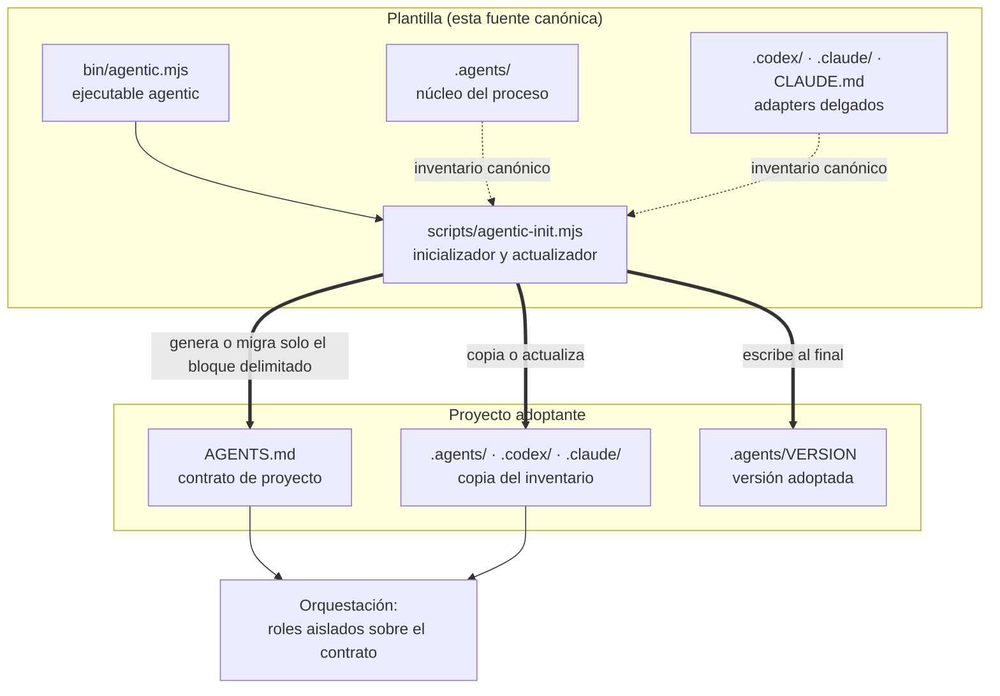
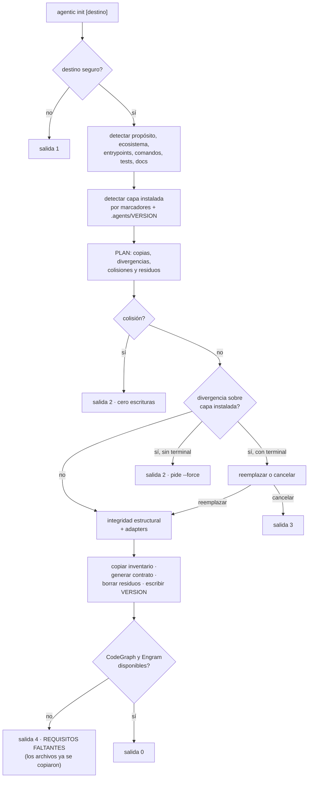
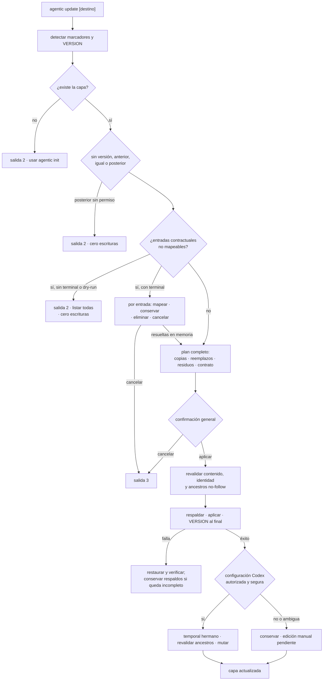
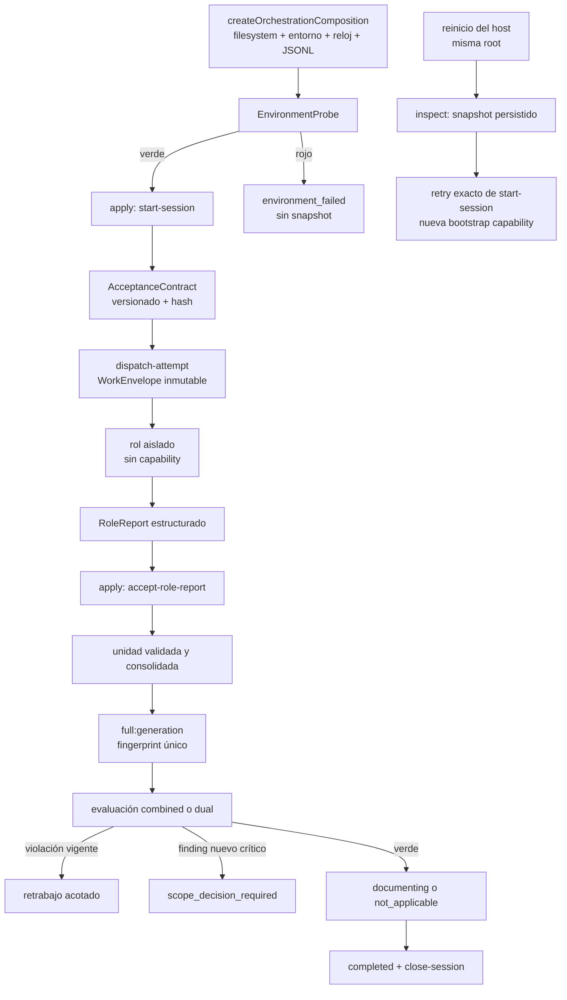

# Arquitectura

Detalle interno de la plantilla. La vista resumida está en el
[README](../README.md); el vocabulario, en [CONTEXT.md](../CONTEXT.md). Esta
documentación no se distribuye con la capa.

## Las dos mitades

El repositorio hace dos cosas independientes, y conviene no confundirlas:

1. **El proceso** (`.agents/` y sus adapters): lo que gobierna cómo un agente
   desarrolla en un proyecto. Las políticas y roles son contratos; el kernel
   ejecuta sus invariantes estructuradas.
2. **La adopción y actualización** (`bin/` y `scripts/`): lo que copia o
   actualiza ese proceso y mantiene su contrato. Es código; se ejecuta solo por
   orden explícita del propietario y no sincroniza el destino automáticamente.



La flecha que no existe es la importante: el destino no vuelve hacia la
plantilla. No hay dependencia declarada, remoto upstream ni sincronización
automática — ver [ADR 0001](adr/0001-adopcion-por-copia.md).

## Estructura completa

```text
.
├── README.md                    # adopción y operación (se distribuye)
├── CONTEXT.md                   # glosario del dominio (no se distribuye)
├── AGENTS.md                    # reglas globales + contrato de proyecto
├── CLAUDE.md                    # import fijo de AGENTS.md
├── LICENSE
├── package.json                 # proyección npm exacta del inventario canónico
├── .gitignore
├── bin/
│   └── agentic.mjs              # ejecutable; despacha `init` y `update`
├── scripts/
│   ├── agentic-check.mjs        # node --check derivado del inventario
│   └── agentic-init.mjs         # única implementación de init/update
├── tests/
│   ├── agentic-init.test.mjs    # inicialización y adopción
│   ├── agentic-update.test.mjs  # update y rollback
│   ├── codex-config.test.mjs    # configuración Codex
│   ├── orchestration-kernel.test.mjs
│   ├── kernel-cli.test.mjs      # conducción del kernel por procesos separados
│   ├── productive-composition.test.mjs
│   ├── distribution-contracts.test.mjs
│   └── agentic-test-helpers.mjs # fixtures aislados compartidos
├── docs/                        # documentación interna (no se distribuye)
│   ├── arquitectura.md
│   └── adr/
├── .agents/                     # NÚCLEO — fuente de verdad del proceso
│   ├── README.md                # documentación del módulo interno
│   ├── VERSION                  # generado en la adopción, no distribuido
│   ├── policies/
│   │   ├── orquestacion.md      # precedencia, preflight, modos, delegación
│   │   ├── regla-de-oro.md       # regla transversal para código y pruebas
│   │   └── sdd-tdd.md            # SDD proporcional y vocabulario de diseño
│   ├── protocol.json              # inventario y schema de overrides admitidos
│   ├── kernel/
│   │   ├── composition.mjs        # única composición productiva
│   │   ├── orchestration-kernel.mjs # interface apply/inspect
│   │   ├── adapters.mjs           # stores, clocks, probes y sinks
│   │   ├── protocol-manifest.mjs   # valida y proyecta protocol.json
│   │   └── protocol.mjs           # hashing y contratos base
│   ├── scripts/
│   │   └── kernel-cli.mjs         # CLI delgado apply/inspect/help del kernel
│   ├── schemas/                   # AcceptanceContract, RoleReport, eventos y evidencia
│   ├── conformance/               # gate de protocolo y drift
│   ├── roles/                   # seis roles: entradas, proceso, salida, límites
│   │   ├── explorador.md
│   │   ├── planificador.md
│   │   ├── implementador.md
│   │   ├── tester.md
│   │   ├── evaluador.md
│   │   └── documentador.md
│   ├── workflows/
│   │   ├── feature.md
│   │   ├── bugfix.md
│   │   ├── refactor.md
│   │   └── architecture.md
│   ├── skills/                  # procedimientos portables
│   │   ├── orquestar/SKILL.md
│   │   ├── agentic-grilling/SKILL.md
│   │   ├── agentic-tdd/SKILL.md
│   │   └── agentic-diagnostico-bugs/
│   │       ├── SKILL.md
│   │       └── references/      # contrato HITL + esqueletos sh y ps1
│   ├── templates/
│   │   ├── dev-session.md       # estado global de una tarea
│   │   └── subdev-session.md    # sobre efímero por fase e intento
│   └── sessions/
│       └── gitignore.asset      # se instala como .gitignore
├── .codex/agents/               # ADAPTER — seis TOML
└── .claude/
    ├── gitignore.asset          # se instala como .gitignore
    ├── agents/                  # ADAPTER — seis Markdown
    └── skills/orquestar/SKILL.md
```

## Mapa de módulos

| Parte | Responsabilidad | Profundidad |
| --- | --- | --- |
| `.agents/policies/` | Orquestación, SDD/TDD y Regla de Oro para código y pruebas | Profundo: gobierna todo el proceso |
| `.agents/roles/` | Seis contratos de salida con límites explícitos | Profundo: cada rol oculta su método |
| `.agents/kernel/composition.mjs` | Construir los adapters productivos y exponer `apply/inspect` más bootstrap opaco | Delgado: único composition root |
| `.agents/scripts/kernel-cli.mjs` | Conducir `apply/inspect` desde procesos host y exponer `help` derivado del código | Delgado: adapter de la composición |
| `.agents/kernel/orchestration-kernel.mjs` | Estado, CAS, idempotencia, ownership, aceptación, lanes, presupuesto, persistencia y telemetría | Profundo: solo `apply/inspect` |
| `.agents/kernel/adapters.mjs` | Filesystem/memoria, reloj, preflight y event sinks | Profundo: seams de producción y tests |
| `.agents/protocol.json` y `.agents/kernel/protocol-manifest.mjs` | Inventario instalado, assets, directorios gestionados y overrides del host | Fuente declarativa y consumidor compartido |
| `.agents/schemas/` y `.agents/conformance/` | Validar contratos y rechazar mezclas o drift | Gate distribuible |
| `.agents/workflows/` | Orden de fases por intención | Delgado: sólo secuencia |
| `.agents/skills/` | Routing de orquestación y disciplinas invocables (grilling, TDD, diagnóstico) | `orquestar` delgada; disciplinas especializadas profundas |
| `.agents/templates/` | Formato de la DevSession global y de los sobres efímeros | Delgado: estructura |
| `AGENTS.md` | Seam de configuración: hechos y restricciones del proyecto | Interface mínima de toda la capa |
| `.codex/agents/*.toml` | Nombre, descripción, sandbox y puntero al rol canónico | Delgado por diseño |
| `.claude/agents/*.md` | Frontmatter de herramientas y permisos, y puntero al rol | Delgado por diseño |
| `.claude/skills/orquestar/` | Activación nativa que remite a la skill canónica | Delgado por diseño |
| `CLAUDE.md` | Importa `AGENTS.md` y fija el routing actual sin duplicar política | Delgado por diseño |
| `bin/agentic.mjs` | Despacho de `init`, `update` y ayuda | Delgado: no reimplementa nada |
| `scripts/agentic-check.mjs` | Derivar los `.mjs` distribuidos y ejecutar `node --check` | Delgado: consumidor del manifiesto |
| `scripts/agentic-init.mjs` | Detección, plan, copia/actualización recuperable, contrato, configuración opcional de Codex y comprobaciones | Profundo: toda la adopción y actualización |
| `tests/*.test.mjs` | Comportamiento público por interfaz, en procesos paralelos con directorios raíz temporales exclusivos | Especificación ejecutable |
| `tests/agentic-test-helpers.mjs` | Fixtures de filesystem y CLI sin estado global mutable | Helper profundo de tests |

Este mapa expresa ownership, no una obligación de repetir reglas. El inventario
operativo de propietarios y la responsabilidad exacta de cada consumidor se
mantienen en el [README interno](../.agents/README.md#mapa-de-propietarios): la
política posee decisiones humanas transversales, el kernel sus invariantes
ejecutables, workflows el orden, roles sus contratos, la skill el routing y las
plantillas solo los datos persistidos.

La regla que mantiene la interface pequeña: un proyecto normal edita
`AGENTS.md` y nada más — ver [ADR 0002](adr/0002-agents-md-como-unico-seam.md).
Los adapters aplican restricciones técnicas y apuntan a rutas canónicas; nunca
duplican políticas.

## Flujo de adopción

`agentic init` es transaccional: calcula el plan completo antes de escribir y
cualquier condición bloqueante lo detiene con el disco intacto.



Puntos que no son obvios leyendo el código por partes:

- **La detección no pregunta nunca.** Lo que no puede inferir queda como campo
  pendiente y se lista al terminar — ver
  [ADR 0003](adr/0003-inicializador-sin-conversacion.md).
- **Lo ya declarado gana.** Los valores explícitos que ya estén en el contrato
  sobreviven a cualquier reejecución; `--force` no reescribe `AGENTS.md` fuera
  del bloque delimitado, ni dentro de él.
- **Una copia de la plantilla no hereda su propósito.** Si el destino trae el
  `AGENTS.md` y el `README.md` de la plantilla sin tocar, el propósito detectado
  se descarta y queda pendiente: es el del proceso, no el del proyecto.
- **Revalidación justo antes de escribir.** Si un archivo aparece o cambia entre
  el plan y la escritura, se aborta el resto.
- **Salida 4 no revierte nada.** La capa queda instalada; lo que falta son las
  herramientas que el preflight de orquestación exigirá después — ver
  [ADR 0004](adr/0004-requisitos-obligatorios-con-fallo-cerrado.md).

## Flujo de actualización

`agentic update` reutiliza el mismo motor y añade una transacción recuperable.
La configuración opcional de Codex ocurre después del éxito de la capa y nunca
la revierte.



La migración contractual reconoce campos históricos por alias y los contratos
nuevos por IDs estables. Solo `<pendiente: …>`, el placeholder histórico
admitido y los estados textuales `TODO`, `pendiente`, `por definir` o `TBD`
cuentan como valores ausentes; autolinks Markdown y otros hechos legítimos con
ángulos se preservan.

Los campos y bullets que no puedan mapearse se reúnen por completo antes de
construir cualquier escritura. En modo interactivo cada entrada puede dirigirse
a un campo canónico libre, conservarse, eliminarse con confirmación adicional o
cancelar toda la actualización. Las elecciones solo mutan el plan en memoria;
`AGENTS.md` se escribe junto con la transacción y participa en el mismo rollback.
En `--yes`, `--non-interactive`, sin TTY o `--dry-run`, el comando informa todas
las entradas y alternativas, termina con salida `2` y deja el destino byte a
byte intacto.

El bloque delimitado es el **contrato administrado** y solo admite el esquema
canónico con sus IDs estables. Conservar una entrada es una elección explícita
que la retira de ese bloque y mantiene el bullet y sus continuaciones bajo
`## Reglas adicionales del proyecto`, fuera de los marcadores. La sección se
reutiliza si existe y la transformación es idempotente; esas reglas siguen
siendo instrucciones efectivas de `AGENTS.md`, aunque ya no sean parte del
contrato administrado.

El editor de `config.toml` entiende únicamente la forma inequívoca de `[agents]`
y las claves `max_concurrent_threads_per_session` o `max_threads`. Conserva BOM,
finales de línea, comentarios y el resto del archivo. Tablas o claves ambiguas,
UTF-8 inválido y strings TOML multilínea se derivan a edición manual sin escribir.
La ruta global se obtiene de `CODEX_HOME` o del directorio personal; las pruebas
siempre inyectan una raíz temporal. El valor objetivo es 12 como capacidad
técnica de Codex; los workflows aplican después sus topes independientes de 4
(`light`) y 9 (`full`).

## Flujo de orquestación

El runtime principal no interpreta Markdown. El orquestador posee la única
capacidad de mutación y los roles son productores aislados de reportes:



`createOrchestrationComposition` es el único composition root productivo. Su
objeto público tiene `apply`, `inspect` y la capacidad bootstrap como dato
opaco; no agrega operaciones al kernel. Construye `FileSystemStateStore`,
`SystemEnvironmentProbe`, reloj y telemetría JSONL, y no crea agentes, instala
herramientas ni modifica Git. Recrearlo sobre la misma raíz permite leer una
DevSession y recuperar autoridad únicamente mediante el retry exacto mostrado.

`.agents/scripts/kernel-cli.mjs` es la frontera de host sobre esa composición:
cada invocación (`apply`, `inspect`, `help <tipo>`) es un proceso efímero que
ejecuta ese mismo retry leyendo `recovery.bootstrapCommand` de la vista de
`inspect` — el kernel persiste el `start-session` exacto, sin capacidad, dentro
del snapshot — y aplica después el comando pedido. La capacidad nunca se
serializa: `help` deriva las claves de payload de `COMMAND_PAYLOAD_KEYS`
exportado por el kernel y los `KernelError` conservan su `code` en stderr — ver
[ADR 0012](adr/0012-cli-del-kernel-como-frontera-de-host.md).

`StateStore` serializa cada sesión y publica snapshots atómicos.
`FileSystemStateStore` vuelve a demostrar la contención física antes de crear,
leer, reemplazar o anexar: rechaza ancestros redirigidos y enlaces ajenos en
snapshot/event log, y no escribe fuera de `root` ante una ruta ambigua. `MemoryStateStore`
ejecuta la misma superficie pública que el adapter de filesystem.
`Clock` separa timestamps UTC de duración monotónica, `EnvironmentProbe`
comprueba el entorno antes del primer snapshot y `EventSink` conserva el log
append-only sin prompts, capacidades ni secretos.

La idempotencia se resuelve antes de CAS: el mismo `commandId` y payload devuelve
el resultado original; un payload distinto produce `idempotency_conflict`; un
comando nuevo con revisión vieja produce `stale_revision`. Un fallo del sink
posterior al snapshot no revierte una transición confirmada: se registra como
degradación observable. Cada evento se guarda primero en
`telemetry.pendingEvents` dentro del snapshot; un retry exacto completa ese
outbox sin repetir la transición. El sink JSONL relee los IDs durables antes de
append para deduplicar incluso después de reiniciar el proceso.

La configuración del host usa exactamente las propiedades declaradas en
`protocol.json`. `contextBudgetBytes` se valida y recibe allí su default;
`telemetrySink` nombra una entrada del mapa interno `telemetrySinks`, cuya
resolución selecciona el `EventSink` observable. `capabilityTtlMs` conserva una
entrada separada del constructor porque es una opción interna de seguridad, no
un override público. La configuración del proyecto adoptante continúa viviendo
en el contrato de `AGENTS.md`; son dos seams distintos.

La factory recibe esos overrides en `configuration` y los resolvers en
`telemetrySinks`. Cache, temporales, capacidades ambientales y TTL siguen siendo
opciones internas de composición y nunca se incorporan a `protocol.json`.

## Activación del flujo

La política canónica decide primero con hechos observables; este diagrama
resume el enrutamiento y deja la lista cerrada de riesgos en
`.agents/policies/orquestacion.md`.

```mermaid
flowchart TD
    task["tarea"] --> explicit{"instrucción<br/>explícita?"}
    explicit -->|"orquestar / full"| full["modo full"]
    explicit -->|light| light["modo light"]
    explicit -->|sin orquestar| eligible{"¿cumple todos los<br/>límites directos?"}
    explicit -->|ninguna| risk{"¿señal cerrada<br/>de full?"}
    risk -->|sí| full
    risk -->|no| eligible
    eligible -->|sí| direct["ejecución directa<br/>verificada"]
    eligible -->|no| missing{"¿falta un hecho que<br/>cambiaría la categoría?"}
    missing -->|sí| ask["consultar solo<br/>ese hecho"]
    missing -->|no| stopDirect["detenerse y explicar<br/>el límite concreto"]
    full --> pre["preflight:<br/>CodeGraph · Engram ·<br/>subagentes · contrato"]
    light --> pre
    pre -->|falla| stop["detenerse con<br/>diagnóstico breve"]
    pre -->|pasa| sess["start-session:<br/>modo + capacidades +<br/>estrategia light"]
    sess --> topology{"¿light compacto?"}
    topology -->|no| plan["explorar y planificar<br/>DAG de 1–3 unidades"]
    topology -->|sí| bugcompact{"¿bugfix?"}
    bugcompact -->|sí| reproduce["Tester reproduce<br/>antes de planificar"]
    bugcompact -->|no| compactplan["Planificador absorbe exploración<br/>y declara 1 unidad writer"]
    reproduce --> compactplan
    compactplan --> compactimpl["Implementador:<br/>implemented + evidencia"]
    compactimpl --> compacteval["Evaluador combinado read-only:<br/>diff + criterios + validación focalizada"]
    compacteval --> compactapproved{"¿aprobado?"}
    compactapproved -->|no, máximo 2 ciclos| compactimpl
    compactapproved -->|sí: validated + consolidated<br/>+ fan-in + eje combined| docgate
    plan --> ready["seleccionar unidades listas<br/>y formar oleada"]
    ready --> dispatch["dispatch-attempt:<br/>unidad · permiso · revisión · hilo"]
    dispatch --> perm{"permiso"}
    perm -->|read-only| lane["carril aislado<br/>dentro del fan-out"]
    perm -->|writer| lock["reserva global única<br/>del working tree"]
    lane --> work["ejecutar rol"]
    lock --> work
    work --> impl["Implementador:<br/>implemented + evidencia"]
    impl --> strategy{"estrategia de validación<br/>registrada"}
    strategy -->|independent-rerun| rerun["repetir señal"]
    strategy -->|distinct-acceptance-check| distinct["señal de aceptación<br/>distinta"]
    strategy -->|verified-evidence-reuse| reuse["revisar vigencia,<br/>diff y cobertura"]
    rerun --> test["Tester juzga y produce<br/>evidencia atribuible"]
    distinct --> test
    reuse --> test
    test --> green{"validada?"}
    green -->|no| rework["fallo + causa + impacto<br/>nuevo intento"]
    rework --> invalidate["invalidar ejes<br/>y subir generación"]
    invalidate --> ready
    green -->|sí| consolidated["validated + consolidated<br/>cerrar hilo"]
    consolidated --> all{"¿todas las unidades?"}
    all -->|no| ready
    all -->|sí| fanin["fan-in de la<br/>generación vigente"]
    fanin --> fulltest["validación integrada<br/>según la política"]
    fulltest --> axes["evaluación según<br/>estrategia registrada"]
    axes --> approved{"¿todos los ejes<br/>aprobados?"}
    approved -->|no| rework
    approved -->|sí| docgate{"¿documentación o<br/>memoria durable?"}
    docgate -->|sí| document["Documentador"]
    docgate -->|no| nodoc["registrar No aplica"]
    document --> close["consolidar Engram<br/>close-session"]
    nodoc --> close
```



El ciclo Evaluador → Implementador admite **dos** retrabajos como máximo; si el
rechazo persiste, la tarea se detiene y se presenta el diagnóstico.

Cada fase corre aislada y devuelve sólo su contrato de salida. El orquestador es
el único que habla con el usuario: los roles no se coordinan entre sí ni amplían
el alcance.

`architecture` tiene un cierre distinto: explora, compara, obtiene aprobación
explícita y registra la decisión. Si no hay implementación, termina allí. Si la
hay, transfiere la decisión una sola vez a `feature` o `refactor`; ese workflow
posterior asume en exclusiva implementación, testing, evaluación y documentación
final.

### Presupuesto, capacidad y aislamiento

La capacidad se compone y no se representa con un único número:

| Dimensión | Semántica |
| --- | --- |
| Capacidad técnica de Codex | Hasta 12 hilos de subagentes; habilita, pero no cambia la política |
| Presupuesto `light` | Máximo 4 subagentes activos |
| Presupuesto `full` | Máximo 9 subagentes activos |
| Capacidad de plataforma | Disponibilidad real detectada en el host |
| Capacidad `read-only` | Carriles de lectura simultáneos, acotados por modo y plataforma |
| Aislamiento de escritores | Uno por working tree sin worktrees aislados aprobados |

El Orquestador no cuenta en 4/9. La capacidad total de agentes es el mínimo
entre modo y plataforma; la capacidad efectiva de una fase añade el trabajo
listo y los topes del rol. Los carriles `read-only` y writers consumen el total,
pero se contabilizan por separado: un writer no ocupa el cupo de lectura y un
lector no ocupa aislamiento de escritura. Con menos capacidad se reduce el
fan-out usando agentes reales; no se simulan agentes ni se sustituyen por
procesos auxiliares.

El presupuesto `light` sigue siendo un techo de capacidad. La estrategia
compacta reduce la topología real y normalmente abre un solo contexto por fase;
no intenta ocupar cuatro carriles ni crea Explorador o Tester posterior cuando
su marcador no los declara.

### Unidades, intentos, DAG y gates

El Planificador registra de una a tres unidades verticales en `full`. En
`light` registra exactamente una unidad writer, sin dependencias. Cada unidad
guarda `workUnitId`, `criterionIds`, `dependsOn`, `ownedPaths`,
`permission: "writer"` y una `validationStrategy` admitida; el kernel deriva su
`wave` del DAG. El kernel rechaza contratos incompletos, IDs duplicados,
dependencias ausentes, ciclos y colisiones antes de crear la DevSession.

La unidad y el intento son identidades distintas. La primera representa el
trabajo a través de sus retrabajos; el segundo es una ejecución monotónica de
fase y rol que declara `baseRevision`, `threadId`, fase, permiso, objetivo,
reglas, tareas, findings y `contextManifest`, y persiste criterios completos,
ownership, estrategia, oleada, causa e intento anterior. Un intento terminal
es inmutable. Una unidad validada sólo se reabre con impacto demostrado.

Explorador, Planificador y Evaluador despachan con permiso `read-only`;
Implementador y Documentador con `writer`; Tester admite `writer` cuando posee
una unidad y `read-only` para lane integral o reproducción. El kernel valida la
combinación con rol, unidad, lane y lifecycle antes de mutar.

En la ruta separada los gates son mecánicos:

1. el Implementador consolida evidencia y deja la unidad `implemented`;
2. el Tester sólo puede abrir sobre ese estado y la deja `validated` o
   `failed`;
3. una validación verde la deja además `consolidated` y puede satisfacer
   `dependsOn`.

La evidencia focalizada pertenece a la unidad y el reporte del Tester conserva
la autoridad del gate. En compacto, el Evaluador combinado abre directamente
sobre `implemented` y su veredicto actualiza de forma atómica unidad, fan-in y
eje `combined`; no existe un Tester posterior. La selección de estrategia, su
vigencia y el momento de la validación integrada pertenecen a la
[política de orquestación](../.agents/policies/orquestacion.md), no a este
documento. El kernel persiste únicamente el estado necesario para rechazar
transiciones o evidencia obsoletas; no añade otra máquina para reinterpretar la
decisión humana.

Las oleadas se derivan del DAG y contienen únicamente unidades listas. La
propiedad de rutas writer es exclusiva y portable: se normalizan rutas
relativas, se rechazan escapes y se detectan colisiones exactas o de
ancestro/descendiente, incluidas mayúsculas y aliases terminales de Windows.

### Proyección de contexto y traspaso de reportes

La DevSession global es el ledger durable y recuperable. No se carga en cada
contexto aislado: `dispatch-attempt` recibe `contextManifest` y proyecta un
`WorkEnvelope` autocontenido con hash y tipo de contrato, identidades de sesión
e intento, versión, generación, `sourceRevision`, `baseRevision`, `threadId`,
fase, rol, permiso, criterios completos, `ownedPaths`, `validationStrategy`,
`wave`, objetivo, reglas, tareas, findings, manifiesto y una lista ordenada
`contextPaths`. El kernel deriva `sourceRevision` y `contextPaths`, valida rutas
relativas portables y rechaza índices protegidos, directorios, escapes, aliases
y duplicados antes de escribir. El sobre nunca contiene capacidades de
mutación ni el ledger.

El despacho normal contiene únicamente el `WorkEnvelope`, la instrucción breve
de ejecutar el contrato del rol y acceso a CodeGraph y Engram. El rol lee solo
ese sobre y las referencias seleccionadas; no recibe cuerpos
copiados. Ante un dato indispensable ausente devuelve la incógnita exacta. El
orquestador puede fallar el intento y abrir otro con causa y contexto corregido,
pero nunca reescribe retrospectivamente un sobre activo.

`accept-role-report` incorpora el `RoleReport` estructurado. Su schema JSON y el
runtime coinciden: todo finding no informativo exige `reproduction`; un finding
informativo puede omitirla. La vista humana global añade una referencia de
tamaño acotado con identidad, atribución, resultado y hash; el snapshot sigue
siendo dueño de revisiones, gates, evidencia y evaluación. Por eso `inspect` no
necesita interpretar Markdown.

La política canónica selecciona `contextPaths` mínimos para cada rol. Evaluador
sigue siendo obligatorio. Documentador se abre después de la aprobación sólo si
hay documentación afectada o una interfaz pública, un artefacto contractual,
una decisión durable o memoria validada pendiente; en otro caso se registra `No
aplica` sin crear el contexto. `close-session` exige que todos los intentos
abiertos hayan terminado.

### Writer lock, recuperación e idempotencia

El aislamiento writer no es local a una DevSession. El store deriva la
identidad canónica del working tree, sincroniza un candidato completo y publica
por hard link un único archivo `.writer-<workingTreeId>.lock`. La reserva
persistida usa `schemaVersion: 3`; su dueño exacto contiene `session`, `attempt`
y `workingTreeId`, y su checkpoint conserva comando, fingerprint y revisión.
Dos DevSessions del mismo árbol compiten por la misma reserva aunque declaren
rutas diferentes. Los snapshots de una versión anterior o los incompletos que
declaran la versión actual fallan de forma cerrada; no existe negociación de
formatos ni migración implícita.

Cada transición adquiere el lock correspondiente y valida ownership antes de
liberarlo. La liberación exige que el snapshot demuestre al mismo intento en
estado terminal. Repetir un comando exacto repara una reserva propia residual
sin reclamar ni retirar la de un intento sucesor. Los locks transitorios se
recuperan sólo cuando su PID ya no está activo; candidatos interrumpidos se
retiran por identidad, mientras un propietario ambiguo se conserva. Ninguna
recuperación usa antigüedad.

### Fan-in y generaciones

En la ruta separada, el kernel sólo marca la integración lista cuando todas
las unidades están validadas y consolidadas. En compacto, el Evaluador combinado
puede abrir sobre la única unidad implementada y una aprobación produce
simultáneamente consolidación y fan-in. El kernel persiste estrategia,
riesgo y generación, valida sus valores ejecutables y, al reabrir una unidad,
incrementa la generación e invalida resultados anteriores. La política canónica
es la única propietaria de la elegibilidad humana de cada estrategia y de las
categorías admitidas; esta sección documenta únicamente el estado y las
transiciones del kernel. El modelo base está en
[ADR 0009](adr/0009-paralelismo-controlado-por-unidades.md) y la simplificación
vigente en [ADR 0010](adr/0010-cierre-y-evaluacion-proporcionales-al-riesgo.md).

## Frontera de distribución

El inventario existe una sola vez en `.agents/protocol.json`. El consumidor
`protocol-manifest.mjs` deriva de allí las rutas instaladas, los assets con
nombre neutro, los directorios gestionados y `PACKAGE_FILES`; `package.json`
mantiene la proyección estática que npm requiere y el inicializador exige que
coincida exactamente. La conformidad recorre cada artefacto declarado, valida
markers y requisitos de contenido, comprueba semánticamente todos los schemas y
rechaza cualquier mezcla con `schemaVersion` distinto de `3` antes de abrir una
DevSession.

El mismo `protocolPackageFiles()` alimenta `scripts/agentic-check.mjs`: filtra
los `.mjs` que viajan y ejecuta `node --check` sobre todos. Por eso `npm run
check`, el contrato raíz y README no mantienen listas sintácticas paralelas.

| Categoría | Ejemplos | Viaja |
| --- | --- | --- |
| Inventario canónico | `.agents/`, `.codex/`, `.claude/`, `CLAUDE.md` | Sí |
| Soporte de la distribución | `AGENTS.md`, `README.md`, `LICENSE`, `package.json`, `bin/`, `scripts/` | Sí |
| Assets de distribución | `gitignore.asset` ×2 | Sí, con nombre neutro |
| Estado del proyecto | `.agents/VERSION`, DevSessions reales, `*.local.json` | No |
| Herramientas locales | `.codegraph/`, `.engram/`, `node_modules/`, `*.tgz` | No |
| Desarrollo de la plantilla | `tests/`, `.gitignore` | No |
| Documentación interna | `CONTEXT.md`, `docs/` | No |

Dos consecuencias que sorprenden al leer el código:

- **`.gitignore` no puede distribuirse con su nombre.** npm renombra a
  `.npmignore` cualquier `.gitignore` empaquetado, así que los dos que la capa
  instala viajan como `gitignore.asset` y el inicializador restaura el nombre
  canónico al copiarlos.
- **Los enlaces a documentación interna sólo se comprueban aquí.** La
  integridad estructural resuelve todos los enlaces Markdown del inventario,
  pero omite los que apuntan a rutas exclusivas del desarrollo cuando corre
  desde un paquete instalado, donde esas rutas no existen — ver
  [ADR 0006](adr/0006-documentacion-interna-fuera-de-la-distribucion.md).

## Contrato de proyecto

El inicializador crea, completa o reemplaza únicamente el bloque delimitado, y
conserva literalmente todo lo que haya antes y después:

```markdown
<!-- AGENTIC_PROJECT_CONTRACT_START -->

## Desarrollo
- Activación de la Regla de Oro para cambios de código o pruebas

## Proyecto
- Propósito / Arquitectura / Entrypoints

## Validación
- Focalizada / Completa

## Tests
- Framework / Ubicación / Ciclo de vida

## Git
- Rama o estrategia permitida

## Seguridad
- Secretos / Rutas protegidas / Datos inmutables / Acciones restringidas /
  Contaminación de origen

## Documentación
- README y documentación técnica / ADRs

<!-- AGENTIC_PROJECT_CONTRACT_END -->
```

Solo el marcador generado `<pendiente: …>`, el placeholder histórico admitido,
un valor vacío o uno que empiece por `TODO`, `pendiente`, `por definir` o `TBD`
cuenta como ausente. Los autolinks y otros valores explícitos con ángulos no son
placeholders. La regla
`STRICT_PROJECT_CONTRACT_RULE` de `.agents/policies/orquestacion.md` lo cobra y
detiene la orquestación indicando archivo, sección y campo exactos. El
propietario puede flexibilizar o eliminar ese bloque delimitado; hacerlo cambia
una garantía de la capa deliberadamente.

Un `AGENTS.md` anidado redefine para su sector Proyecto, Validación, Tests y
Documentación. Nunca debilita seguridad, requisitos de herramientas ni
orquestación: esas restricciones se acumulan y prevalece la más estricta.

## Deuda de vocabulario conocida

Dos nombres del código no siguen el glosario y se conservan a propósito para no
romper la interface pública:

- La salida del plan usa `validar:` para «el archivo ya coincide con el
  canónico», mientras que `Validación` en el contrato significa la evidencia
  del proyecto. Son cosas distintas con la misma palabra; el segundo sentido es
  el canónico.
- `PACKAGE_FILES` conserva ese nombre público en los tests, pero ahora es la
  proyección npm derivada del inventario canónico de `protocol.json`.
